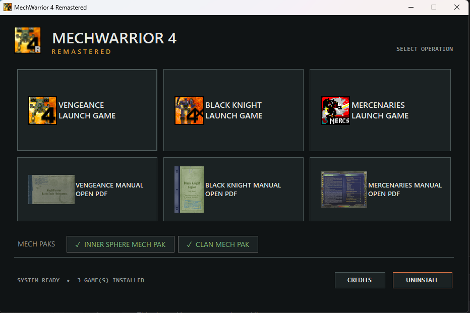
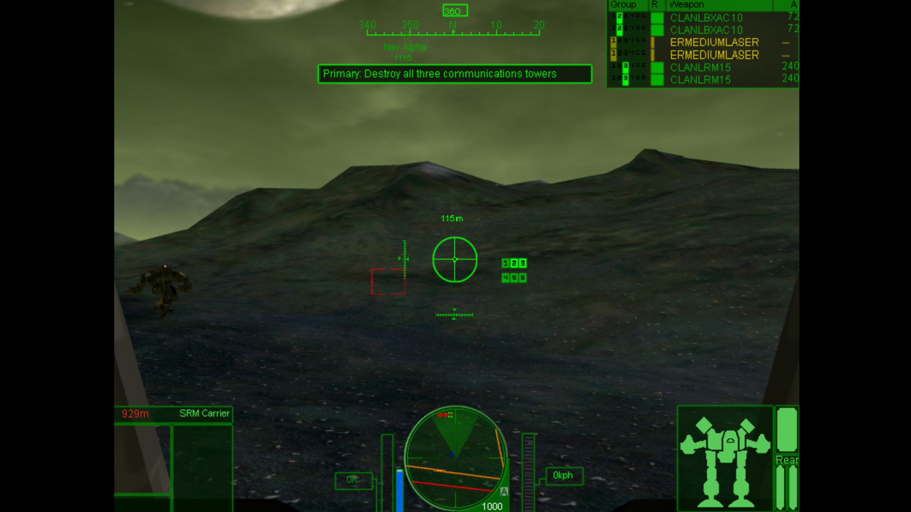
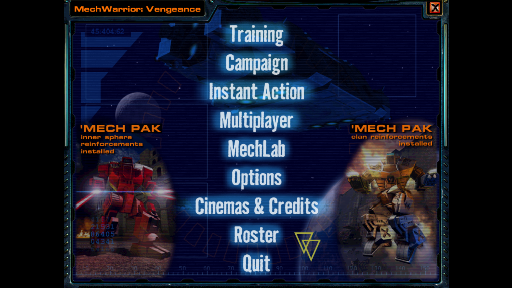
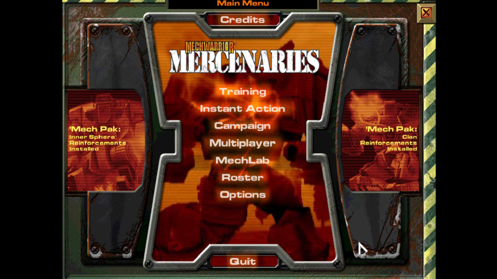

# MechWarrior 4 Remastered

An unofficial community installer for running MechWarrior 4: Vengeance, Black Knight, and Mercenaries on modern Windows. It builds the games from original media you provide, applies the required official updates and compatibility transforms, and installs one launcher for the games, Mech Paks, and cleaned manuals.

This project is not affiliated with or endorsed by Microsoft, FASA Interactive, Cyberlore Studios, The Topps Company, or any current rights holder.

## ⬇️ Download the installer

### [Download MechWarrior 4 Remastered v0.6.45.9012 Setup.exe](https://github.com/Icehellionx/MechWarrior-4-Remastered/releases/download/v0.6.45.9012/MechWarrior-4-Remastered-Setup-0.6.45.9012.exe)

Current release: [v0.6.45.9012](https://github.com/Icehellionx/MechWarrior-4-Remastered/releases/tag/v0.6.45.9012)

The installer does **not** contain the games: setup asks for your original ISOs, supported CUE/BIN pairs, or ZIP archives and builds the installed games from those files.

Legacy download: [v0.6.44 Setup.exe](https://github.com/Icehellionx/MechWarrior-4-Remastered/releases/download/v0.6.44/MechWarrior-4-Remastered-Setup-0.6.44.exe). If the new version gives you trouble, please [log the problem in Issues](https://github.com/Icehellionx/MechWarrior-4-Remastered/issues/new?template=bug_report.yml) and use the legacy version for now. If the issue is specific to your ISO/ZIP/BIN revision, please reach out to me directly so I can work with you to obtain your version for testing; do not post game media in an issue.

1. Download and run the installer.
2. Add the ISO, supported CUE/BIN, or ZIP files for the games and optional Mech Paks you own.
3. Open the new desktop launcher and choose a game or manual.

If the direct link does not work, open the [latest release page](https://github.com/Icehellionx/MechWarrior-4-Remastered/releases/latest) and download the setup EXE under **Assets**.

## Screenshots

| Launcher | Vengeance gameplay |
| --- | --- |
| [](docs/screenshots/launcher.png) | [](docs/screenshots/vengeance-gameplay.png) |

| Vengeance main menu | Mercenaries main menu |
| --- | --- |
| [](docs/screenshots/vengeance-main-menu.png) | [](docs/screenshots/mercenaries-main-menu.png) |

## Windows warning and checksum

The installer is currently unsigned. Windows may display **Unknown publisher** or a Microsoft Defender SmartScreen warning. Verify the SHA-256 digest before deciding whether to run it; never disable SmartScreen or antivirus protection globally for this project.

SHA-256 for v0.6.45.9012:

```text
99308010a9f824c6c2642be1188ef62fd2e72a60f18b483d459945488b8ebdcd
```

```powershell
Get-FileHash .\MechWarrior-4-Remastered-Setup-0.6.45.9012.exe -Algorithm SHA256
```

## What you need

- Windows 10 or Windows 11 on an x64 PC.
- Original MechWarrior 4 media supplied as supported ISO files, single-track MODE1/2352 CUE/BIN pairs, or ZIP archives.
- Vengeance is required before installing Black Knight or the retail Inner Sphere/Clan Mech Paks.
- Mercenaries is independent.
- Enough free space for the selected games plus temporary extraction space.

The installer accepts supported combinations of Vengeance discs 1 and 2, Black Knight, Mercenaries discs 1 and 2, the Inner Sphere Mech Pak, and the Clan Mech Pak.

No ISO, serial key, or extracted proprietary game tree is committed to this repository.

## What setup does

- Validates supported media before modifying the destination.
- Installs Vengeance, Black Knight, Mercenaries, and either optional Mech Pak in their original dependency arrangement.
- Applies the required official updates and reproducible no-disc/compatibility transforms from validated inputs.
- Installs a single MW4-styled launcher for all detected games and manuals.
- Presents every game in a centered, borderless, aspect-correct 4:3 viewport without changing the physical desktop resolution.
- Renders the 3D world at the largest listed game-safe 4:3 resolution fitting the monitor containing the launcher; Settings can select 800×600, 1024×768, or 1600×1200.
- Defaults to the games' Ultra High-equivalent detail settings, 32-bit color, 4× MSAA, and 16× anisotropic filtering.
- Keeps menus, gameplay, and all ordinary cinematics at their original aspect ratio. Only the live-action portion of Vengeance's opening receives a proportional widescreen cover treatment; it is never stretched.
- Keeps the game picture visible during Alt-Tab, releases the cursor while inactive, and recaptures it on return.
- Removes the dgVoodoo watermark and the gameplay-only top/left presentation seam.
- Activates installed Inner Sphere and Clan content across chassis, weapons, and subsystems without bypassing the original model loader.
- Includes the three cleaned game manuals and launcher cover art.
- Creates a desktop shortcut by default and registers a standard Windows uninstaller.
- Removes project-owned files during uninstall while preserving unowned saves and configuration.

## Known limitations

- The release is not Authenticode-signed, so Windows cannot show a verified publisher.
- The current field qualification is strongest on the tested NVIDIA/Windows 11 configuration. Additional GPUs, display layouts, and unusual archival media variants are welcome test coverage.
- Modified, regional, or otherwise unrecognized media fail closed instead of receiving a guessed transform.
- New render settings beyond the default, first-launch mouse placement on other display configurations, and gameplay on other GPUs still need field testing.

## Reporting a bug

Use the [guided bug report form](https://github.com/Icehellionx/MechWarrior-4-Remastered/issues/new?template=bug_report.yml). Include the game, media type, exact step, and retained installer log when relevant.

Before uploading diagnostics, remove personal paths or other private information. Never attach ISOs, extracted game files, serial keys, credentials, or unrelated crash artifacts.

## Development

The application source is under `src`, packaging is under `packaging`, focused contracts are under `tests`, and pinned third-party provenance is under `third_party`.

```powershell
dotnet run --project tests/MW4Remastered.Core.Tests/MW4Remastered.Core.Tests.csproj --configuration Release
./tests/ApplicationPrivilegeBoundary.Tests.ps1
./tests/CompatibilitySourceBuild.Tests.ps1
./tests/PackagingContract.Tests.ps1
./tests/PresentationCompatibilityContract.Tests.ps1
./tests/ReleaseTreePolicy.Tests.ps1
./tests/UserFlowContract.Tests.ps1
```

See [BUILDING.md](BUILDING.md) for the complete local-input and release-build contract. Release binaries are published through GitHub Releases rather than committed to Git history.

## License

Original project source is available under the [MIT License](LICENSE). That license does not grant rights to MechWarrior, BattleTech, the original games, manuals, trademarks, or third-party components. See [REDISTRIBUTION.md](REDISTRIBUTION.md) and [third-party notices](third_party/THIRD-PARTY-NOTICES.md).
