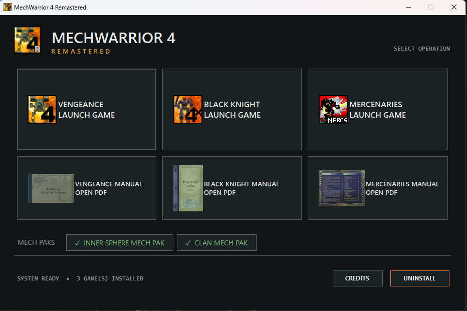
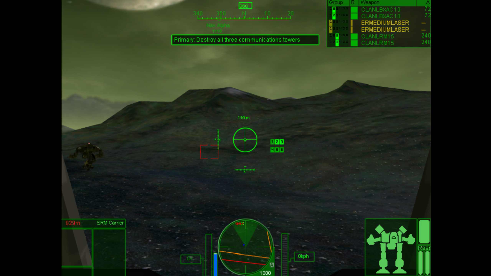
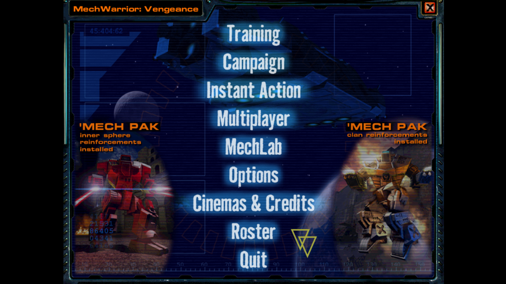
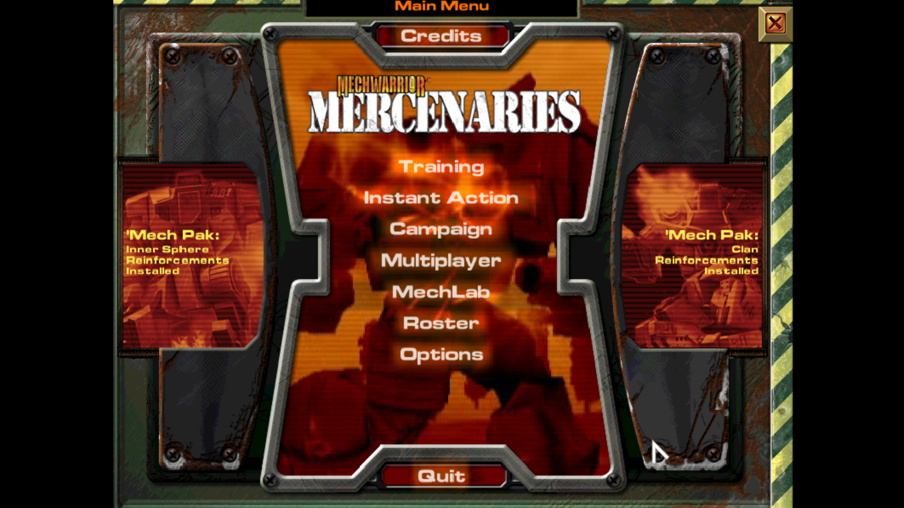

# MechWarrior 4 Remastered

An unofficial community installer for running MechWarrior 4: Vengeance, Black Knight, and Mercenaries on modern Windows. It builds the games from original media you provide, applies the required official updates and compatibility transforms, and installs one launcher for the games, Mech Paks, and cleaned manuals.

This project is not affiliated with or endorsed by Microsoft, FASA Interactive, Cyberlore Studios, The Topps Company, or any current rights holder.

## ⬇️ Download the installer

### [Download MechWarrior 4 Remastered v0.6.47.4 Setup.exe](https://github.com/Icehellionx/MechWarrior-4-Remastered/releases/download/v0.6.47.4/MechWarrior-4-Remastered-Setup-0.6.47.4.exe)

Current test release: [v0.6.47.4](https://github.com/Icehellionx/MechWarrior-4-Remastered/releases/tag/v0.6.47.4). Stable fallback: [v0.6.46](https://github.com/Icehellionx/MechWarrior-4-Remastered/releases/tag/v0.6.46).

This test release makes Vengeance, Black Knight, and Mercenaries system DPI aware to address the [display-scaling mouse issue](https://github.com/Icehellionx/MechWarrior-4-Remastered/issues/8). Black Knight launched with the change at 125% scaling in a Windows 11 VM; affected users have not yet confirmed mouse behavior in a mission. The game-local movie-decoder workaround and optional joystick mode from v0.6.47.3 remain included. The affected video-crash PC and physical joysticks have not yet confirmed those changes. In the launcher, click **JOYSTICK OFF** to enable joystick input before starting a game; leave it off to keep the previous launch behavior.

The installer does **not** contain the games: setup asks for your original ISOs, supported CUE/BIN pairs, or ZIP archives and builds the installed games from those files.

Older legacy download: [v0.6.45.9012 Setup.exe](https://github.com/Icehellionx/MechWarrior-4-Remastered/releases/download/v0.6.45.9012/MechWarrior-4-Remastered-Setup-0.6.45.9012.exe). If you are reinstalling in a folder used by an earlier copy and have trouble, **first back up any saves or settings you want to keep, uninstall the old copy, delete the leftover installation folder, and retry**. If the new version still gives you trouble, please [log the problem in Issues](https://github.com/Icehellionx/MechWarrior-4-Remastered/issues/new?template=bug_report.yml) and use the stable fallback for now. If the issue is specific to your ISO/ZIP/BIN revision, please reach out to me directly so I can work with you to obtain your version for testing; do not post game media in an issue.

1. Download and run the installer.
2. Add the ISO, supported CUE/BIN, or ZIP files for the games and optional Mech Paks you own.
3. Open the new desktop launcher and choose a game or manual.

If the direct link does not work, open the [v0.6.47.4 release page](https://github.com/Icehellionx/MechWarrior-4-Remastered/releases/tag/v0.6.47.4) and download the setup EXE under **Assets**.

## Screenshots

| Launcher | Vengeance gameplay |
| --- | --- |
| [](docs/screenshots/launcher.png) | [](docs/screenshots/vengeance-gameplay.png) |

| Vengeance main menu | Mercenaries main menu |
| --- | --- |
| [](docs/screenshots/vengeance-main-menu.png) | [](docs/screenshots/mercenaries-main-menu.png) |

## Windows warning and checksum

The installer is currently unsigned. Windows may display **Unknown publisher** or a Microsoft Defender SmartScreen warning. Verify the SHA-256 digest before deciding whether to run it; never disable SmartScreen or antivirus protection globally for this project.

SHA-256 for v0.6.47.4:

```text
6dd3f531f1f0e23b9502602b0580dfbe6baa6f376ad6bf696d95a6eb8faa33a2
```

```powershell
Get-FileHash .\MechWarrior-4-Remastered-Setup-0.6.47.4.exe -Algorithm SHA256
```

## What you need

- Windows 10 or Windows 11 on an x64 PC.
- Original MechWarrior 4 media supplied as supported ISO files, single-track MODE1/2352 CUE/BIN pairs, or ZIP archives.
- Vengeance is required before installing Black Knight or the retail Inner Sphere/Clan Mech Paks.
- Mercenaries is independent.
- Enough free space for the selected games plus temporary extraction space.

The installer accepts supported combinations of Vengeance discs 1 and 2, Black Knight, Mercenaries discs 1 and 2, the Inner Sphere Mech Pak, and the Clan Mech Pak.

No ISO, serial key, or extracted proprietary game tree is committed to this repository.

## What setup does

- Validates supported media before modifying the destination.
- Installs Vengeance, Black Knight, Mercenaries, and either optional Mech Pak in their original dependency arrangement.
- Applies the required official updates and reproducible no-disc/compatibility transforms from validated inputs.
- Installs a single MW4-styled launcher for all detected games and manuals.
- Presents every game in a centered, borderless, aspect-correct 4:3 viewport without changing the physical desktop resolution.
- Settings previews the centered 4:3 image for common 16:9 (900p, 1080p, 1440p, 4K), 16:10 (1200p, 1600p), and ultrawide (2560×1080, 3440×1440, 5120×2160) monitors. The installed game always uses your current Windows monitor mode; selecting a preview does not switch display resolution.
- Automatically renders the 3D world at the largest game-safe 4:3 resolution fitting the monitor containing the launcher, then scales the centered picture to that monitor.
- Defaults to the games' Ultra High-equivalent detail settings, 32-bit color, 4× MSAA, and 16× anisotropic filtering.
- Keeps menus, gameplay, and all ordinary cinematics at their original aspect ratio. Only the live-action portion of Vengeance's opening receives a proportional widescreen cover treatment; it is never stretched.
- Includes a game-local movie-decoder compatibility workaround for Vengeance and Mercenaries; original videos remain enabled.
- Includes a hash-verified game-local DirectInput adapter and an opt-in joystick button in the launcher for all three games. It installs no virtual joystick driver.
- Keeps the game picture visible during Alt-Tab, releases the cursor while inactive, and recaptures it on return.
- Removes the dgVoodoo watermark and applies a small gameplay-only top/left seam correction.
- Activates installed Inner Sphere and Clan content across chassis, weapons, and subsystems without bypassing the original model loader.
- Includes the three cleaned game manuals and launcher cover art.
- Creates a desktop shortcut by default and registers a standard Windows uninstaller.
- The launcher's per-game removal deletes owned game files while preserving unowned saves and configuration. The Windows uninstaller removes the launcher shell and leaves any game trees for that separate removal action.

## Known limitations

Unreleased launcher changes: joystick input defaults ON when no preference has been saved; an explicit OFF choice is preserved. Adapter errors are reported for the selected game without silently disabling joystick input globally. **HELP & QUIRKS** explains the controls and workarounds inside the launcher. The published v0.6.47.4 download still has the previous opt-in behavior.

MW4 can crash when a device exposes 32 or more buttons. The unreleased source-built adapter now exposes at most 31 buttons to these games and safely omits excess buttons; it does not automatically remap them or expand the original binding screen's supported range. Use controller software or a user-configured tool such as Joystick Gremlin to map extra or ignored buttons to keyboard keys. The exact candidate passed native 31/32/128-button tests and two mission loads with saved in-mission bindings in all three games in an isolated Windows VM. Physical HOTAS, multi-device combinations and force feedback remain field gaps. See the [input research and qualification record](active/INPUT_DISPLAY_RESEARCH.md). The published v0.6.47.4 adapter predates this correction.

- The release is not Authenticode-signed, so Windows cannot show a verified publisher.
- The current field qualification is strongest on the tested NVIDIA/Windows 11 configuration. Additional GPUs, display layouts, and unusual archival media variants are welcome test coverage.
- Modified, regional, or otherwise unrecognized media fail closed instead of receiving a guessed transform.
- First-launch mouse placement on other display configurations and gameplay on other GPUs still need field testing. The ultrawide client-area and mouse-capture corrections in v0.6.46 passed local component tests but still need reports from the affected ultrawide and Windows 10/RX 6750 XT systems; [issue #7](https://github.com/Icehellionx/MechWarrior-4-Remastered/issues/7) and [issue #8](https://github.com/Icehellionx/MechWarrior-4-Remastered/issues/8) remain open for that confirmation.
- The movie workaround has passed local decoder-activation and normal-decoder playback checks, but the PC from [issue #10](https://github.com/Icehellionx/MechWarrior-4-Remastered/issues/10) has not tested this build. On a PC without another usable decoder, affected movie audio may be absent.
- A Windows VM with vJoy selected the adapter in all three games and consumed joystick X-axis in Vengeance and Black Knight first missions; an earlier build with the same adapter consumed it in Mercenaries. Physical sticks, 31/32-button layouts, and consecutive missions still need field testing.

## Reporting a bug

For a failed reinstall into a previously used location, try the old-folder cleanup described above first. Include whether that changed the result in your report.

Use the [guided bug report form](https://github.com/Icehellionx/MechWarrior-4-Remastered/issues/new?template=bug_report.yml). Include the game, media type, exact step, and retained installer log when relevant.

Before uploading diagnostics, remove personal paths or other private information. Never attach ISOs, extracted game files, serial keys, credentials, or unrelated crash artifacts.

## Development

The application source is under `src`, packaging is under `packaging`, focused contracts are under `tests`, and pinned third-party provenance is under `third_party`.

```powershell
dotnet run --project tests/MW4Remastered.Core.Tests/MW4Remastered.Core.Tests.csproj --configuration Release
./tests/ApplicationPrivilegeBoundary.Tests.ps1
./tests/CompatibilitySourceBuild.Tests.ps1
./tests/PackagingContract.Tests.ps1
./tests/PresentationCompatibilityContract.Tests.ps1
./tests/ReleaseTreePolicy.Tests.ps1
./tests/UserFlowContract.Tests.ps1
```

See [BUILDING.md](BUILDING.md) for the complete local-input and release-build contract. Release binaries are published through GitHub Releases rather than committed to Git history.

## License

Original project source is available under the [MIT License](LICENSE). That license does not grant rights to MechWarrior, BattleTech, the original games, manuals, trademarks, or third-party components. See [REDISTRIBUTION.md](REDISTRIBUTION.md) and [third-party notices](third_party/THIRD-PARTY-NOTICES.md).
